# KN01 

## A) 
 Da Docker bereits installiert ist reicht die Prüfung der Version mit `docker --version`
 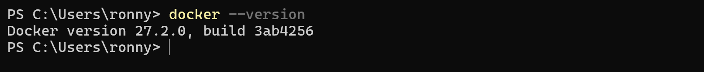

Danach wird das das Image `getting-started` heruntergeladen und kann gestartet werden
 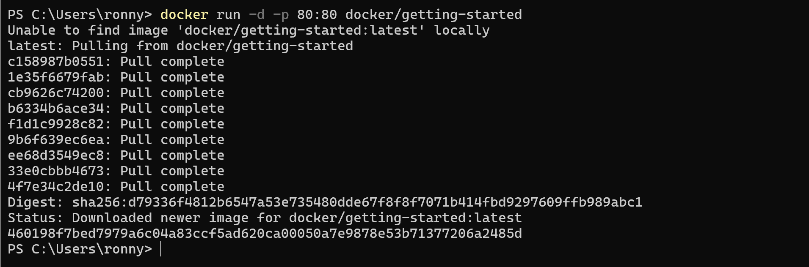

Auf `Localhost` sollte folgende Seite erscheinen:
 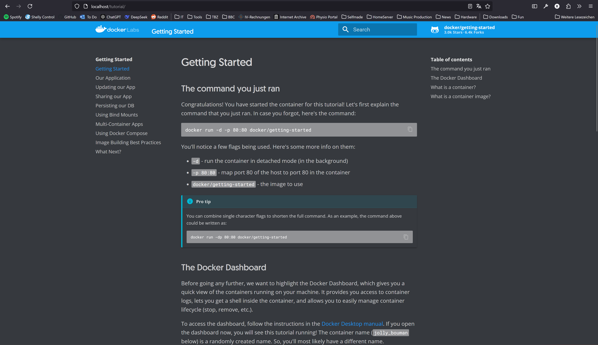

Im Docker Desktop sehen wir den Container `nice_edison` welcher unser eben gepulltes Image darstellt. Daneben finden sich weitere Container für `Paperless-NGX`, `MariaDB` `Win98_inabox` oder `RetroArch` 
 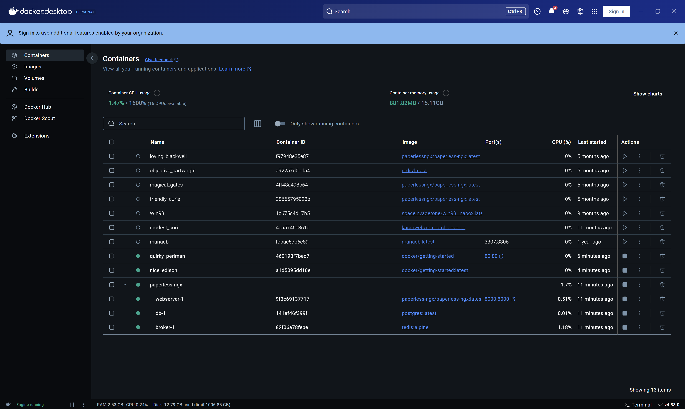


## B)

### Befehle
1. **Docker Version**
```bash
docker --version
``` 


2.  **Search Ubuntu**
```bash
docker search ubuntu
```
 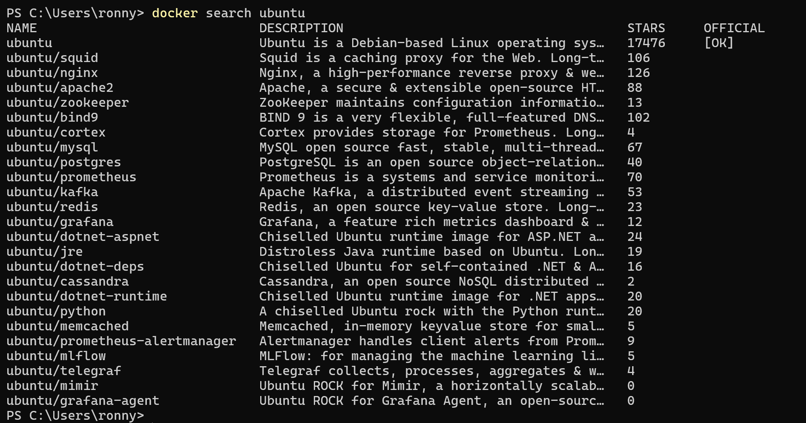


## Nginx
3.  **Search Nginx**
```bash
docker search nginx
```
 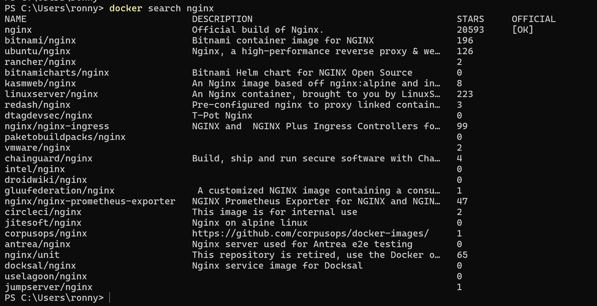

4. `docker pull nginx`
 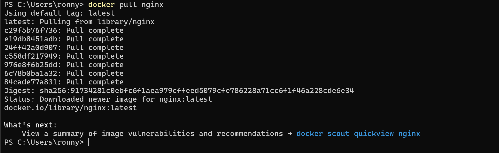

5. `docker create`
 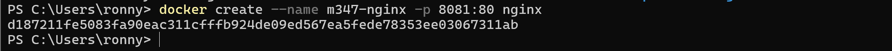
6. `docker start`
 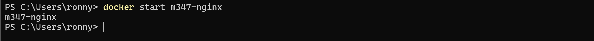

 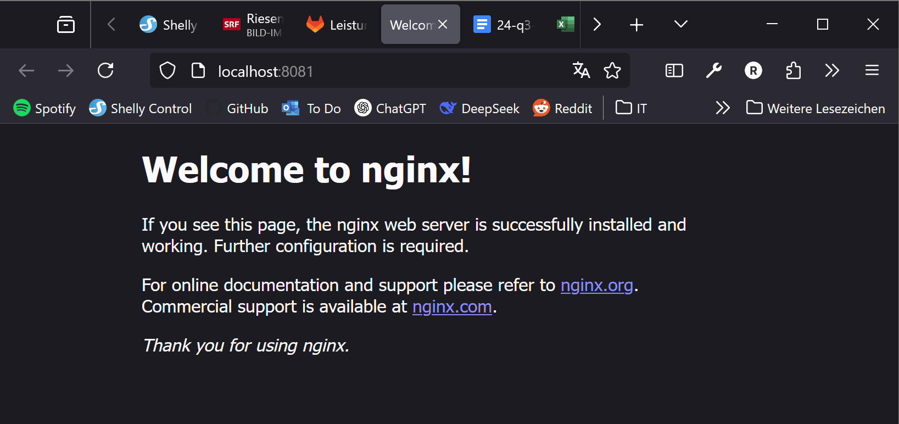

## Ubuntu

1. `docker run -d ubuntu`
 startet den Container tatsächlich, aber er **beendet** sich sofort wieder, weil kein Prozess im Vordergrund läuft, der den Container am Leben hält.
 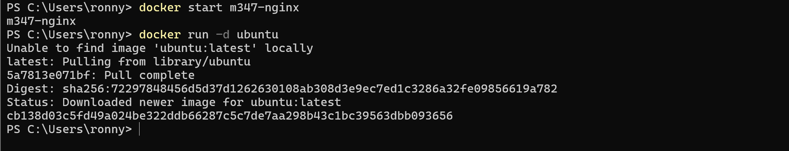

2. `docker run -it ubuntu` startet einen interaktiven Container (mit Shell), den Sie manuell steuern. Der Container bleibt so lange am Leben, bis Sie die Shell verlassen.
 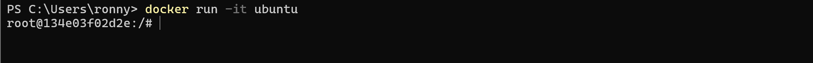

```bash
docker exec -it m347-nginx /bin/bash
```
 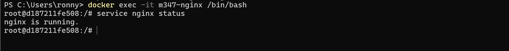


```bash
service nginx status
```
 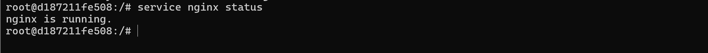

```bash
docker ps
```
Alle laufenden Container
 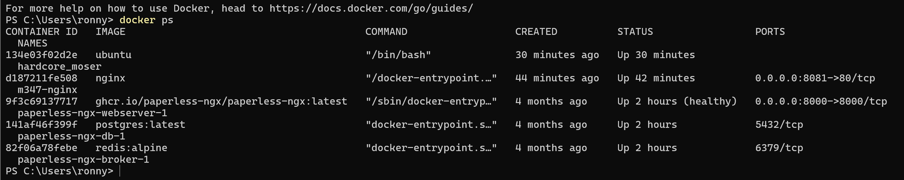
Alle Container
 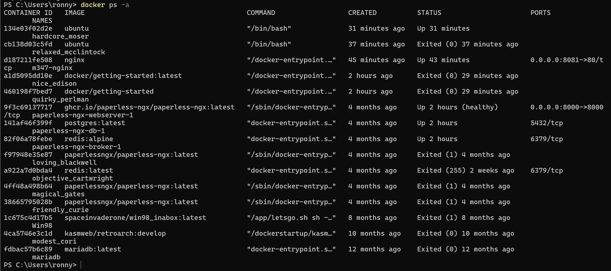

```bash
docker stop m347-nginx
```
 

```bash
docker rm m347-nginx
```
 

```bash
docker rmi ubuntu
```
 

Docker Tag 
```bash
docker tag
```
 

```bash
docker push
```
 