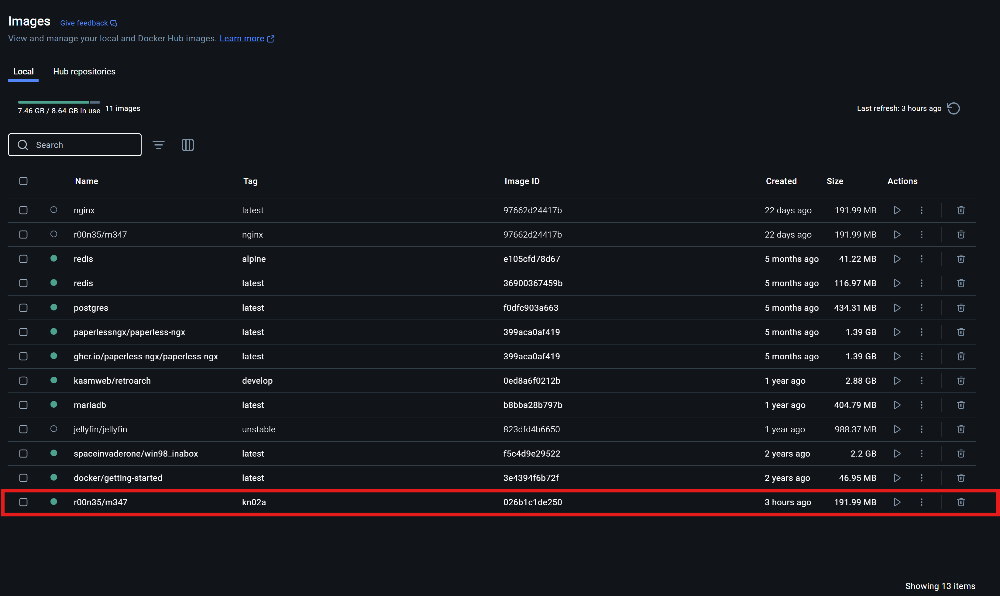
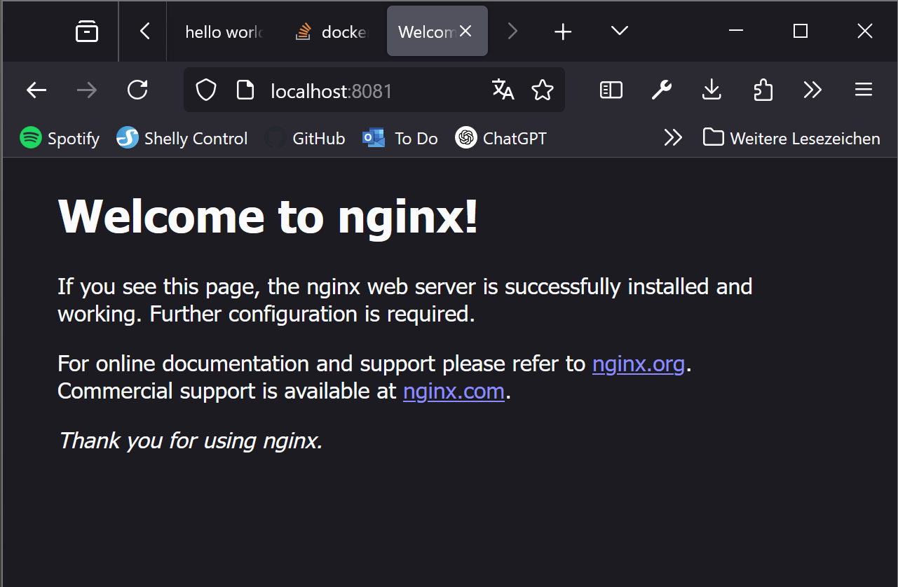
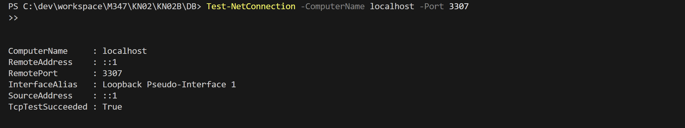
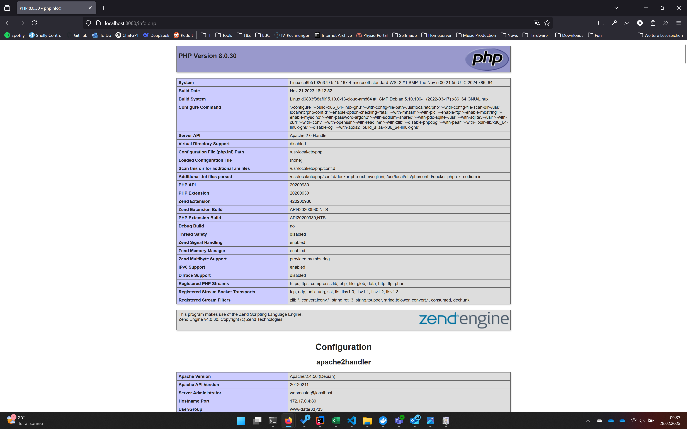
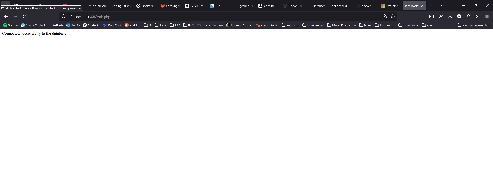

# KN02: Dockerfile

## A) Dockerfile I

```dockerfile
FROM nginx  # official dockerimage from nginx, all configurations and functions 
COPY static-html-directory /var/www/html # static-html-directory gets copied to /var/www/html
EXPOSE 	80	# Port 80 gets opened for the container. Actual mapping happens when the container gets started(e.g. -p 8081:80)
```

Abgaben:

- [x] [Dokumentiertes Docker File](./KN02A/dockerfile)
- [ ]  Dockerfile, welches mit den entsprechenden Zeilen wie oben beschrieben.

- [x] Notwendige Docker-Befehle für das build. Es ist einfacher für den nächsten Schritt, wenn Sie bereits den korrekt Tag für Dockerhub verwenden mit Benutzername, etc.

```bash
docker build -t r00n35/m347:kn02a .
```
- [x] Notwendige Befehle für den Start des Containers und dem push in das private Repository (gemäss KN01)
```bash
docker run -d -p 8081:80 --name kn02a_container r00n35/m347:kn02a
```

```bash
docker push r00n35/m347:kn02a
```

- [x] Screenshot aus Docker Desktop, welcher das Image kn02a zeigt.

- [x] Screenshot der HTML-Seite, der die Seite helloworld.html zeigt, nachdem der Container gestartet wurde


## B) Dockerfile II

Abgaben:

- [ ] DB: telnet Befehl der zeigt, dass der Zugriff auf den DB Server funktioniert (Screenshot)

- [ ] DB: Dockerfile für Ihren DB-Container
[Dockerfile DB](./KN02B/DB/dockerfile.db)
- [ ] DB: docker build und docker run Befehle für Ihren DB-Container.
```shell
docker run -d -p 3307:3306 --name kn02-db r00n35/m347:kn02b-db
```
- Web:  Screenshots der beiden Seinfo.phpiten info.php und db.php



- Web: Dockerfile für Ihren Web-Container

- Web: docker build und docker run Befehle für Ihren Web-Container.

- Web: Angepasste PHP-Dateien