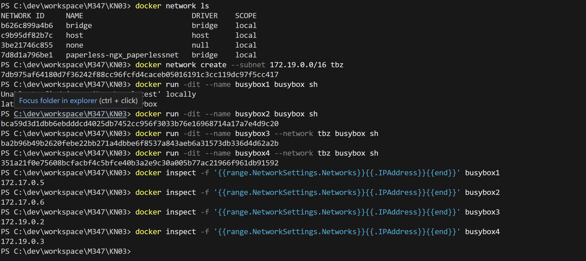
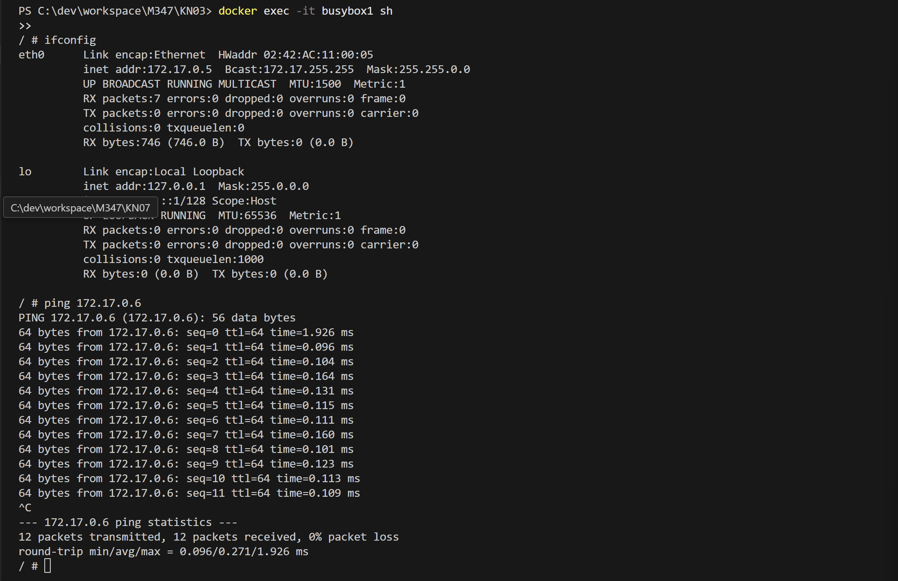
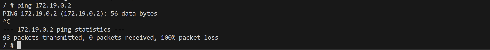
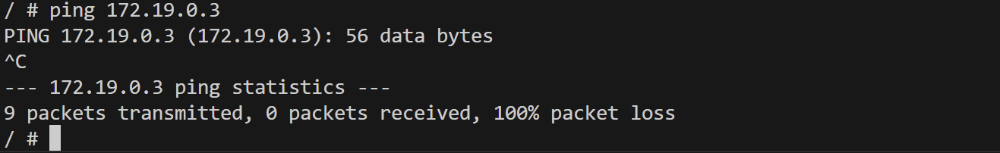
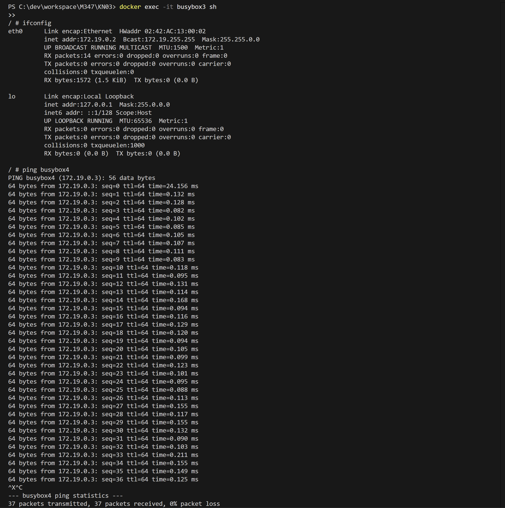
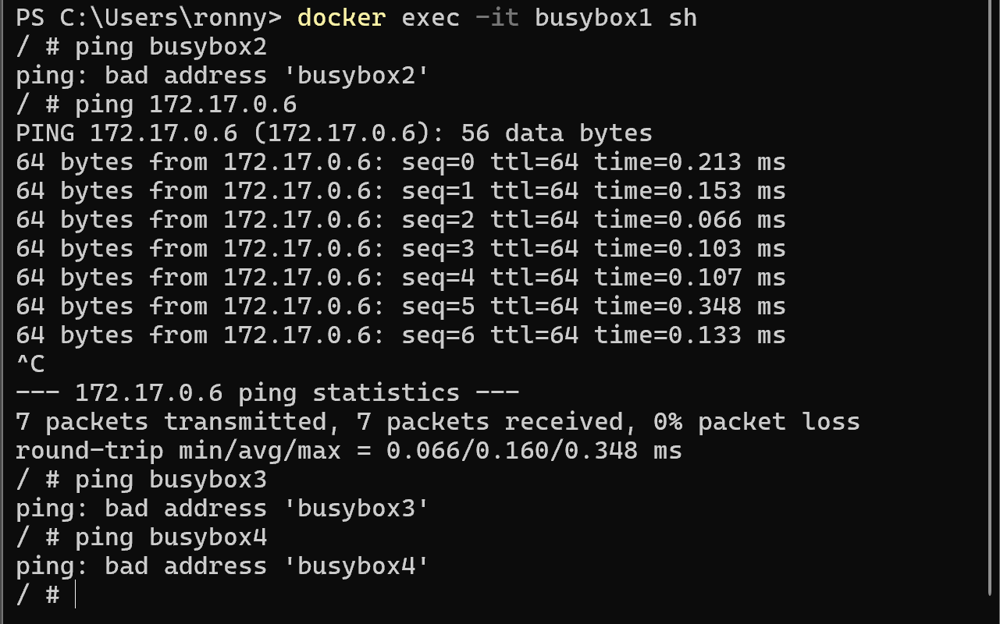
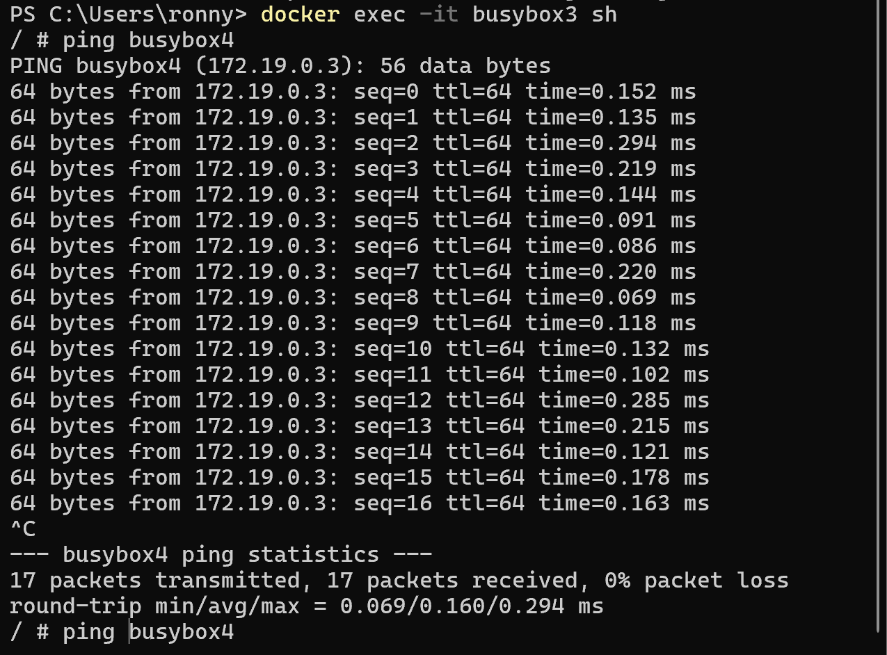

# KN03: Netzwerk, Sicherheit

## A) Eigenes Netzwerk
Mit diesem Befehl weist Docker dem Netzwerk den IP-Adressbereich 172.19.0.0/16 zu.
```shell
docker network create --subnet 172.19.0.0/16 tbz
```

```shell
docker run -dit --name busybox1 busybox sh
docker run -dit --name busybox2 busybox sh
```

```shell
 docker run -dit --name busybox3 --network tbz busybox sh
  docker run -dit --name busybox4 --network tbz busybox sh
```

```bash
docker inspect -f '{{range.NetworkSettings.Networks}}{{.IPAddress}}{{end}}' busybox1

docker inspect -f '{{range.NetworkSettings.Networks}}{{.IPAddress}}{{end}}' busybox2

docker inspect -f '{{range.NetworkSettings.Networks}}{{.IPAddress}}{{end}}' busybox3

docker inspect -f '{{range.NetworkSettings.Networks}}{{.IPAddress}}{{end}}' busybox4
```

**busybox1** 172.17.0.5
**busybox2** 172.17.0.6
**busybox3** 172.19.0.2
**busybox4** 172.19.0.3

```shell
docker exec -it busybox1 sh
```
```shell
ifconfig

oder

ip route
```
## Ping Tests
Von BusyBox1
```shell 
ping 172.17.0.6 
```
✅ Geht im Default Netzwerk
```shell 
ping busybox2 
```
❌ Nur in selbst erstellten Subnetzen möglich, da nur dort nach Namen aufgelöst werden kann


Abgaben:

- [ ] Screenshots der Befehle und deren Resultate. Achtung: Sie können Befehle zusammenfassen. Führen Sie die Befehle in einer sinnvollen Reihenfolge aus.







- [ ] Erklären Sie die Gemeinsamkeiten und Unterschiede. Wie kommen die Zustande und was ist Ihre Schlussfolgerung.


- [ ] Betrachten Sie nun KN02.
    - [ ] In welchem Netzwerk befanden sich die beiden Container?
    Die beiden Container in KN02 waren im Default-Netzwerk
    - [ ] Wieso konnten die miteinander reden?
    Die beiden Container wurden miteinander verlinkt

    ```shell
    docker run -d -p 8080:80 --name kn02b-web --link kn02b-db r00n35/m347:kn02b-web
    ```