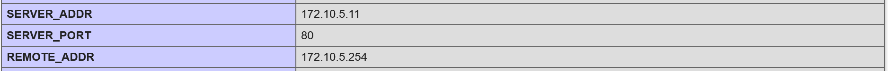
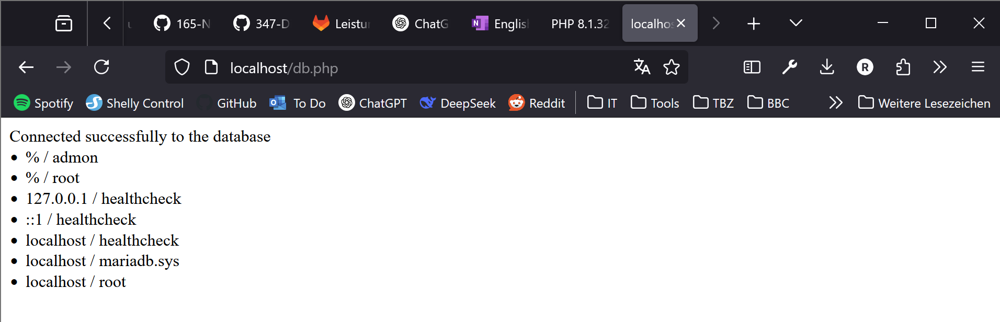
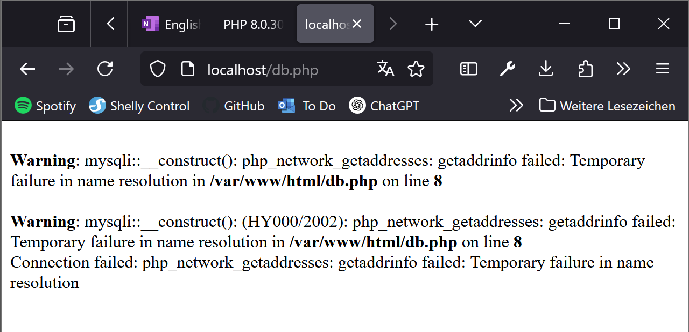
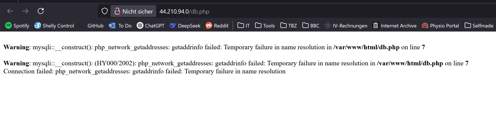
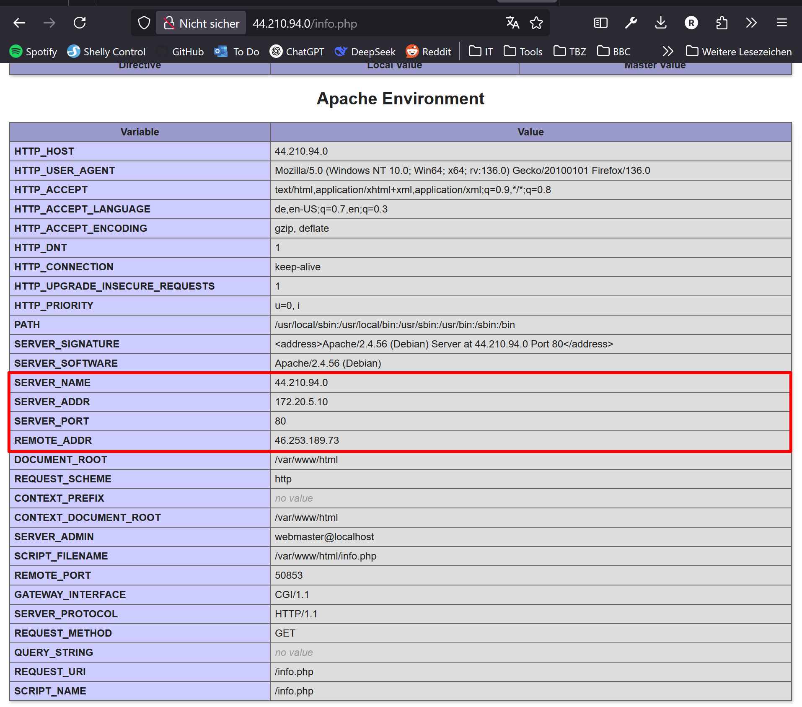

# KN04: Docker Compose
[**Auftrag KN04: Docker Compose** im TBZ GitLab](https://gitlab.com/ch-tbz-it/Stud/m347/-/blob/main/Leistungsbeurteilung/KN04/KN04.md?ref_type=heads)
## A) Docker Compose: Lokal
### Teil a) Verwendung von Original Images

_Abbildung 1: Die beiden Container sind im selben Subnetz_

_Abbildung 2: Auf der Seite `db.php` finden wir erneut die Credentials des admin _

### Files
[docker-compose.yml](././KN04A/docker-compose.yml)

[dockerfile.web](../KN04/KN04A/dockerfile)

## `docker compose up`
Hier eine kurze Erklärung welche Einzelschritte der obige Befehl ausführt.

### 1. `Build` (wenn nötig)
Baut das Image aus dem Dockerfile (wenn definiert)
### 2. Create
- Für jeden Service in der `docker-compose.yml` wird ein Container vorbereitet.
- Hier werden Dinge wie **Netzwerk**, **Environement-Variablen**, **Volumes**, **Ports**, etc eingerichtet.
- Der Container ist nach dem Erstellen noch nicht gestartet, liegt aber "bereit".
### 3. Start
- Nun werden alle soeben erstellten Container tatsächlich gestartet (entspricht `docker start`).
- Dabei werden ggf. Initialiserungsschritte ausgeführt, das Netzwerk wird final verbunden, etc.
### 4. Attach/ Logs
- Führt man docker compose up ohne -d (also nicht im Detached-Modus) aus, werden die Logs aller Container „angehängt“ (attach). Sie sehen dann alle Ausgaben direkt in Ihrem Terminal.
- Bei docker compose up -d (Detached-Modus) läuft alles im Hintergrund, und Sie bekommen direkt die Handlungsfreiheit in Ihrer Shell zurück.

### Teil b) Verwendung eigener Images

address.png)
_Abbildung 3: Hier erneut die `info.php` mit geänderten IP-Adressen_

_Abbildung 4: Auf der Seite `db.php` finden wir diesmal eine Fehlermeldung _

[docker-compose.yml](../KN04/KN04A/b/docker-compose.yml)

Der Fehler tritt auf, weil der im Dockerfile angegebene Containername nicht mit dem tatsächlichen Container-Namen übereinstimmt. Zur Behebung muss der Servername korrekt angepasst werden.

---
## B) Docker Compose: Cloud

_Abbildung 5: `db.php` in **AWS** gehostet_

_Abbildung 6: `info.php` in **AWS** gehostet_

### Files
[KN04B Cloud-Init.yaml](./KN04B/cloud-init.yaml)