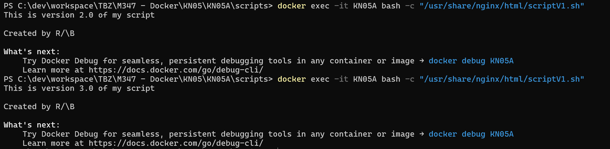

# KN05: Arbeit mit Speicher

**Grundlagen für diesen Auftrag:**
- [TBZ: Arbeit mit Volumes](https://gitlab.com/ch-tbz-it/Stud/m347/-/blob/main/Container/docker/Volumes.md)
- [Docker: Storage](https://docs.docker.com/engine/storage/)
- [Praxistipps.de: Bildschirmaufnahme in Windows 10]()

Sie werden im Folgenden die drei Speicherarten testen.

## A) Bind mounts (40%)
 Zuerst wechseln wir ins Verzeichnis wo das [Skript](../KN05/KN05A/scripts/scriptV1.sh) liegt und von wo aus der Befehl
```bash
docker run -d --name nginx-bind -v "C:\dev\workspace\TBZ\M347 - Docker\KN05\KN05A\scripts:/scripts" nginx
```
ausgeführt wird.
Damit wird das Verzeichnis `scripts` im Container unter `/scripts` verfügbar gemacht.

Dann mit 
```bash
docker exec -it nginx-bind bash -c "/scripts/scriptV1.sh"
```
das Script ausführen im Container. 
Der Output sollte in diesem Falle so aussehen.
```docker
This is version 1.0 of my script

Created by R/\B

What's next:
    Try Docker Debug for seamless, persistent debugging tools in any container or image → docker debug KN04A
    Learn more at https://docs.docker.com/go/debug-cli/ 
```

Wenn das Script nun auf dem Host-System geändert wird, sollte nach erneutem ausführen von
```bash
docker exec -it nginx-bind bash -c "/scripts/scriptV1.sh"
```




Abgabe:

- Liste der Befehle die notwendig waren, um Container mit Volumen zu starten.
- Erstellen Sie einen Screencast, der den beschriebenen Prozess zeigt. Testen Sie Ihn aber erst, bevor Sie den Screencast erstellen (Link in Grundlagen-Teil).


## B) Volumes (30%)
Zuerst wird ein `Volume` erstellt dass von beiden `Containern` erreicht werden soll. 
```bash
docker volume create shared_data
``` 

Dann werden zwei Container gestartet mit den folgenden Befehlen:
```bash
docker run -d --name KN05_C1 -v shared_data:/data nginx
docker run -d --name KN05_C2 -v shared_data:/data nginx
```

Beide Container sollen in dieselbe Datei schreiben:
In KN05_C1:
```bash
echo "Nachricht von Container 1" >> /data/shared.txt
cat /data/shared.txt
```
In KN05_C2:
```bash
echo "Nachricht von Container 2" >> /data/shared.txt
cat /data/shared.txt
```

- [] Erstellen Sie einen Screencast, der den beschriebenen Prozess zeigt. Testen Sie Ihn aber erst, bevor Sie den Screencast erstellen (Link in Grundlagen-Teil).


## C) Speicher mit docker compose (30%)


Abgaben:

- Auszug mit dem Befehl  mount im ersten Container, der zeigt, dass alle drei Speichertypen hinzugefügt wurden.
- Auszug mit dem Befehl  mount im zweiten Container, der zeigt, dass der Speichertyp hinzugefügt wurde.
docker compose Datei (yaml).