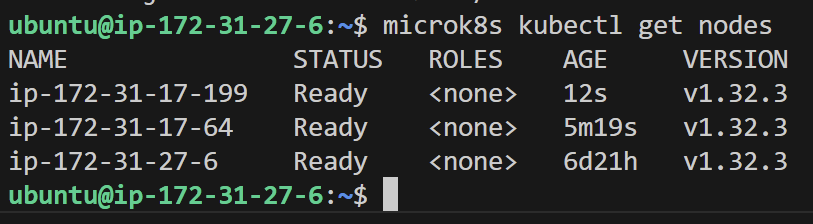
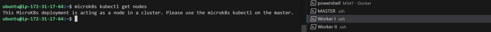
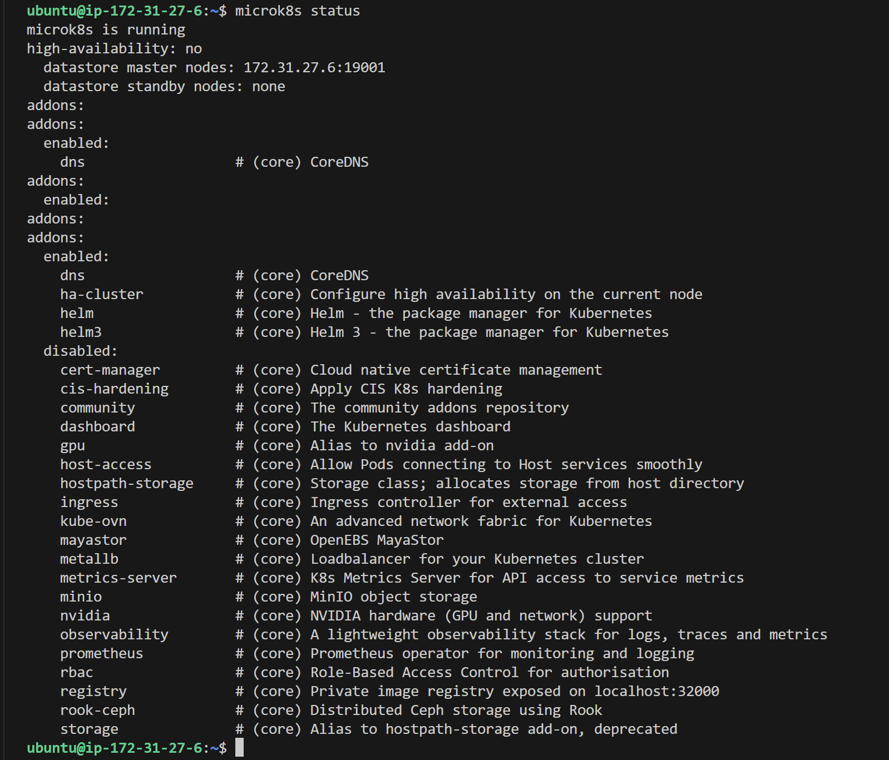
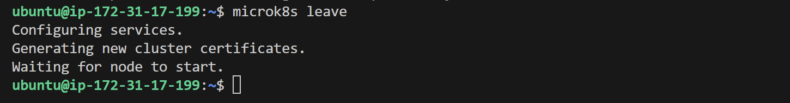
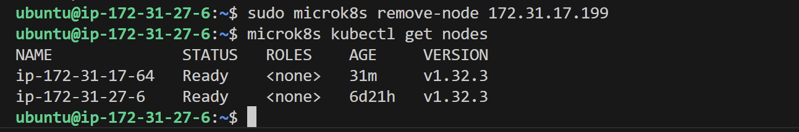
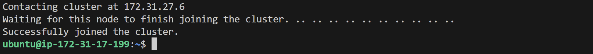

# Kubernetes I

Grundlagen für diesen Auftrag:

[Auftrag KN06: Kubernetes I](https://gitlab.com/ch-tbz-it/Stud/m347/-/blob/main/Leistungsbeurteilung/KN06/KN06.md?ref_type=heads)
TBZ: Kubernetes Architektur
TBZ: MicroK8s
TBZ: Sicherheitsaspekte

## A) Installation (50%)
[cloud-init.yaml](./microk8s.yaml)
Folgen Sie der Installationsanleitung für [MikroK8s auf AWS](https://gitlab.com/ch-tbz-it/Stud/m347/-/tree/main/Kubernetes/microk8s). Sie sollten nun einen Cluster mit drei Nodes haben.

Abgaben:

- Rufen Sie den Befehl `microk8s kubectl get nodes` auf einem der Nodes auf und zeigen Sie mit einem Screenshot, dass alle drei Nodes hinzugefügt wurden

## B) Verständnis für Cluster (50%)
Führen Sie folgende Schritte durch und erstellen Sie die entsprechenden Screenshots dazwischen. Schauen Sie also zuerst nach, welche Screenshots erwartet sind:

- Rufen Sie `microk8s kubectl get nodes` auf einem zweiten der drei Instanzen auf. Dokumentieren Sie das Resultat mit Screenshots

- Rufen Sie den Befehl `microk8s status` auf und schauen Sie die ersten paar Zeilen an (vor "addons"). Was bedeuten diese. Sie finden mehr Information in der Installationsanleitung des Herstellers der Sie gefolgt sind im Kapitel High Availability. Erstellen Sie einen Screenshot und einen Erklärungstext.

- `microk8s is running`
Zeigt an das der MicroK8s-Dienst aktiv ist und der Cluster ordnungsgemäss funktioniert.
- `high-availability: no`
    Im **HA-Modus** gibt es mehrere Master-Knoten um Ausfallsicherheit zu gewährleisten. Hier ist dies jedoch nicht der Fall.
    - `datastore master nodes: 172.31.27.6:19001`
    Diese Zeile gibt die IP-Adresse und den Port des Knotens an, der als Master für den internen Datenspeicher fungiert.

    - `datastore standby nodes: none`
    Standby-Knoten kommen in einer HA-Konfiguration zum Einsatz, um als Backup oder Replikat des Master-Knotens zu fungieren.

    Da der HA-Modus in Ihrem Fall nicht aktiviert ist, werden hier keine Standby-Knoten angezeigt.
    
- Entfernen Sie einen Node vom Cluster. Welche Befehle müssen Sie aufrufen? Zeigen Sie die Resultate der Befehle mit Screenshots.

Auf dem zu entfernenden Knoten wird der Befehl `microk8s leave` ausgeführt. Das macht den Worker-Knoten zu einem Master.

Auf dem Master wird mit dem Befehl `microk8s remove-node 172.31.17.199` der Knoten effektiv aus dem Cluster entfernt. 

- Fügen Sie nun den Node wieder dem Cluster hinzu, aber dieses Mal als Worker (--worker)

- Rufen Sie nochmals den Befehl `microk8s status` auf. Was ist der Unterschied und woher kommt dieser. Erstellen Sie einen Screenshot und einen Erklärungstext

- Rufen Sie nochmals `microk8s kubectl get nodes` auf, sowohl auf einem der Master als auch auf dem Worker. Dokumentieren Sie die Resultate mit Screenshots. Wieso stimmt dies überein  mit dem Result des Befehls microk8s status?

Abgaben:

Erklären Sie den Unterschied zwischen den Befehlen microk8s und microk8s kubectl mit eigenen Worten.
Gemäss den obenstehenden Schritten