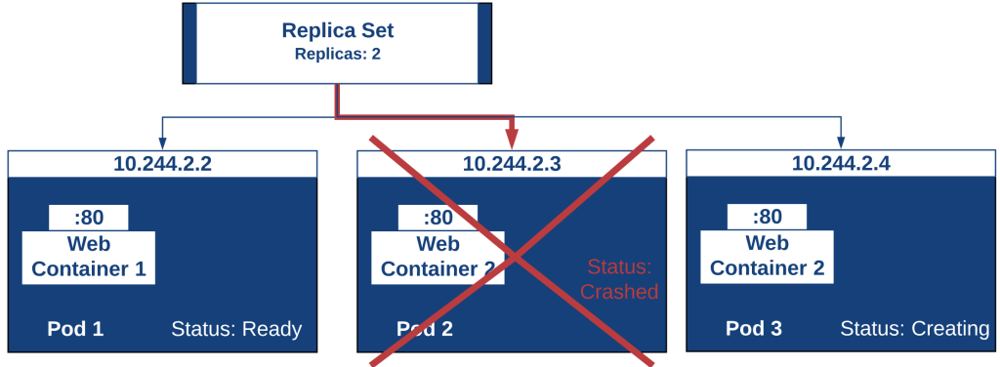
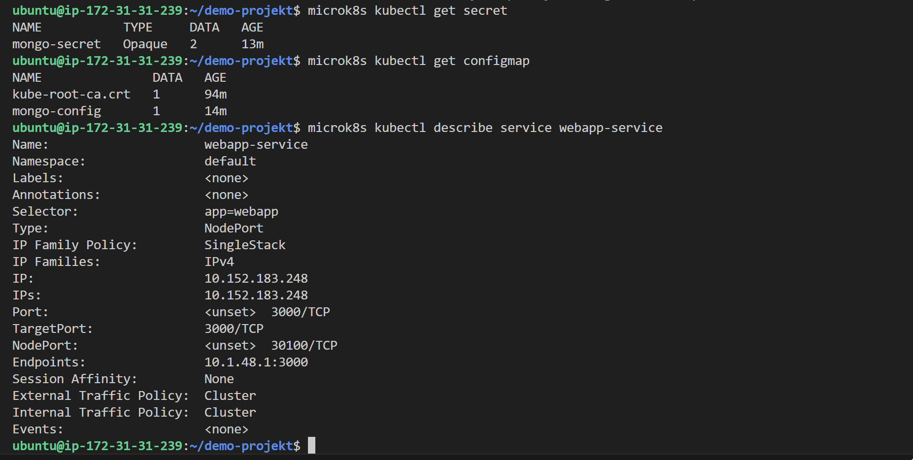
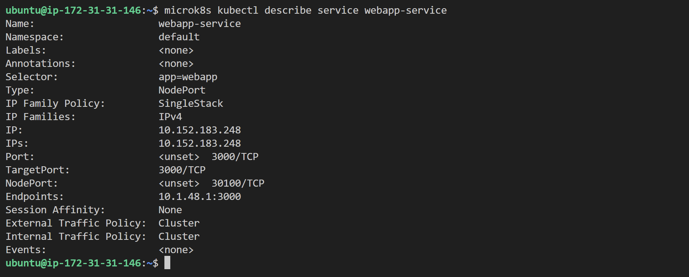
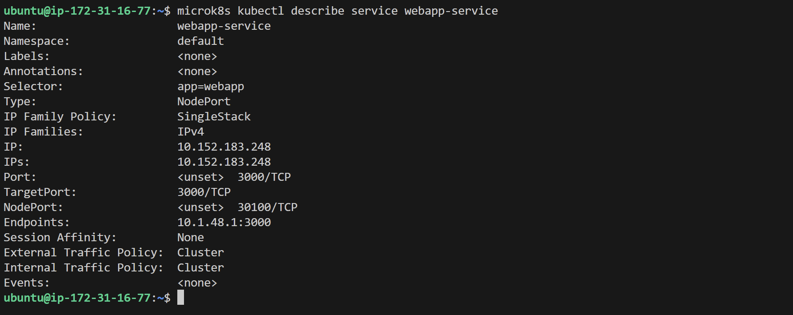
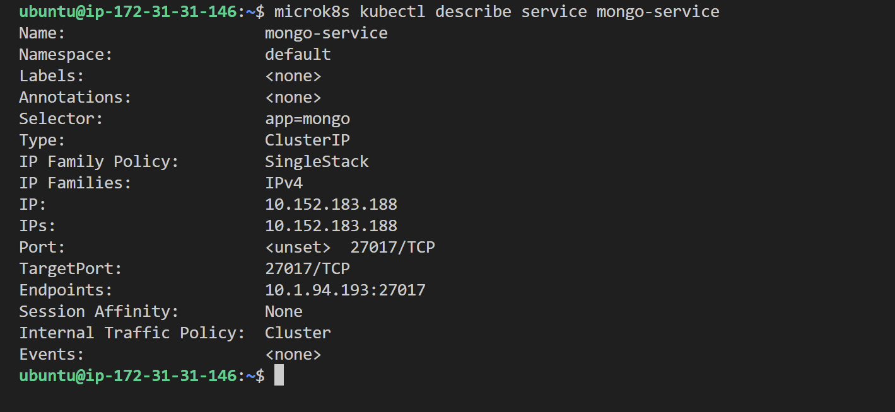

# Kubernetes II
- [KN07: Kubernetes II](#kubernetes-ii)
    - [A) Begriffe und Konzepte erlernen](#a-begriffe-und-konzepte-erlernen-40)
    - [B) Demo Projekt](#b-demo-projekt-60)

**Grundlagen für diesen Auftrag:**
- [Auftrag KN06: Kubernetes II](https://gitlab.com/ch-tbz-it/Stud/m347/-/blob/main/Leistungsbeurteilung/KN07/KN07.md?ref_type=heads)
- [TBZ: Kubernetes Architektur](https://gitlab.com/ch-tbz-it/Stud/m347/-/tree/main/Kubernetes)
- [TBZ: Kubernetes Tutorial](https://gitlab.com/ch-tbz-it/Stud/m347/-/tree/main/Kubernetes/Tutorial)
- [TBZ: Demo Projekt](https://gitlab.com/ch-tbz-it/Stud/m347/-/tree/main/Kubernetes/Demo%20Project)
- [TBZ: Sicherheitsaspekte](https://gitlab.com/ch-tbz-it/Stud/m347/-/tree/main/Kubernetes/Sicherheitsaspekte)

## A) Begriffe und Konzepte erlernen (40%)
Lesen Sie sich ein in die Begriffe und Konzepte im Tutorial.

**Abgaben**

### Unterschied zwischen Pods und Replicas

Ein **Pod** ist die kleinste Ausführungseinheit in Kubernetes und enthält einen oder mehrere Container, die sich Ressourcen wie Netzwerk und Speicher teilen. Eine **Replica** hingegen bezeichnet, wie oft ein bestimmter Pod repliziert werden soll. Wenn ich z. B. 3 Replicas für einen Pod definiere, sorgt Kubernetes dafür, dass dieser Pod drei Mal gleichzeitig läuft – verteilt auf verschiedene Nodes, falls möglich – um Ausfallsicherheit und Lastverteilung zu erreichen.

### Unterschied zwischen Service und Deployment

Ein **Deployment** beschreibt den gewünschten Zustand einer Anwendung, z. B. wie viele Instanzen (Replicas) laufen sollen und welches Container-Image verwendet wird. Kubernetes sorgt dann automatisch dafür, dass dieser Zustand eingehalten wird. Ein **Service** wiederum ist eine abstrakte Schnittstelle, die den Zugriff auf die Pods erlaubt – unabhängig davon, auf welchem Node sie laufen oder wie oft sie repliziert wurden. Der Service balanciert die Anfragen automatisch auf die laufenden Pods.

### Welches Problem löst Ingress?

Ein **Ingress** löst das Problem, mehrere Services über einen einzigen Einstiegspunkt erreichbar zu machen – z. B. über eine einzige öffentliche IP-Adresse oder Domain. So kann ich z. B. über verschiedene Pfade oder Subdomains unterschiedliche Services erreichen, ohne jeden Service einzeln nach außen exposen zu müssen.
### Für was ist ein statefulset?
Ein **StatefulSet** ist dafür gedacht, Pods mit persistenter Identität zu verwalten. Es sorgt dafür, dass Pods immer mit derselben Netzwerkkennung und denselben Speicher-Ressourcen wiederhergestellt werden. Das ist besonders wichtig bei zustandsbehafteten Anwendungen wie z. B. Message Brokern oder Speicherlösungen.
**Beispiel**: Eine Anwendung wie ein verteiltes Dateisystem (z. B. Ceph oder GlusterFS), bei dem jeder Node eine eindeutige Rolle und persistenten Speicher braucht.

## B) Demo Projekt (60%)
Erstellen Sie das Demo Projekt auf Ihrem eigenen Kubernetes Cluster (mit mind. 3 nodes).

### 1. Warum Service nicht wie im Tutorial

#### _"Begründen Sie, welcher Teil nicht wie im Tutorial umgesetzt wurde und wieso."_

Der **MongoDB-Service** wurde als `ClusterIP` erstellt und **nicht nach nach aussen exposed** wie es das Tutorial vorsieht. Dies wurde absichtlich gemacht, um die Sicherheit zu erhöhen - **Datenbanken sollten nur intern im Cluster erreichbar sein.**

### 2. Mongo-URL in `ConfigMap.yaml`

 #### _"Erklären Sie, warum der angegebene Wert korrekt ist."_

In der **ConfigMap** ist `mongo-url: mongo-service` gesetzt. Das ist korrekt, weil `mongo-service` der interne DNS-Name des MongoDB-Service ist. Dieser Name ist im Cluster über K8s DNS erreichbar und wird in der WebApp für den DB-Zugriff verwendet.

### 3. Screenshot von `microk8s kubectl describe service webapp-service` auf zwei Nodes

_Webapp-Service Master_

_Webapp-Service Node 1_

_Webapp-Service Node 2_

#### Unterschiede

### 4. Gleicher Befehl für mongo-service auf einem Node + Unterschiede erklären

- `Type: ClusterIP` => **Nicht von aussen erreichbar**
- `Port: 27017/TCP` => Standard-Mongo-Port
- `Endpoints:` zeigt korrekt den Mongo-Pod und Port `27017`
- `Selector: app=mongo` => Verknüpfung zu den Mongo-Pods

### Unterschiede

- `mongo-service` ist vom Typ `ClusterIP`, hat **keinen NodePort und keine externe IP.**

- `webapp-service` ist vom Typ `NodePort`, hat einen **offenen Port (30100) und ist von aussen erreichbar.** 

### 5. Zugriff über Web-Browser zeigen

### 6. Verbindung zu MongoDB via Compass schlägt fehl - Erklärung warum

Der MongoDB-Service ist vom Typ ClusterIP und damit nur innerhalb des Clusters erreichbar. Das bedeutet, dass kein Zugriff von außen – z. B. mit MongoDB Compass – möglich ist. Dies ist aus Sicherheitsgründen sinnvoll, da Datenbanken in der Regel nicht direkt exponiert werden sollten.
Die WebApp kann intern über mongo-service auf die Datenbank zugreifen, da Kubernetes-DNS den Namen korrekt auflöst.

### 7. Port ändern auf `32000` + Replicas erhöhen auf `3`

Der `webapp-service` wurde angepasst, um den NodePort von 30100 auf 32000 zu setzen.
Zusätzlich wurde im Deployment die Anzahl Replicas auf `3` erhöht, um Lastverteilung und Hochverfügbarkeit zu demonstrieren.

#### Screenshots

_Ausgabe von `microk8s kubectl describe service webapp-service` zeigt NodePort 32000_

_Ausgabe von `microk8s kubectl get pods -o wide` zeigt 3 Pods auf 3 Nodes_

_Browser Zugriff auf alle Nodes mit `http://<Node-IP>:32000`_

## Quellen
- [Replica Sets Bild](https://theithollow.com/2019/01/28/kubernetes-replica-sets/)

[top](#kubernetes-ii)