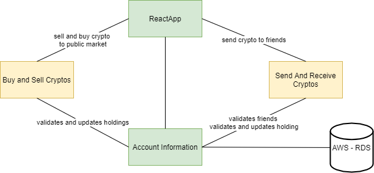

# KN08: Kubernetes III - Microservices

Beachten Sie die [allgemeinen Informationen zu den Abgaben.](https://gitlab.com/ch-tbz-it/Stud/m347/-/blob/main/Kompetenznachweise/Abgaben.md)

**Grundlagen für diesen Auftrag:**

- [TBZ: Kubernetes Architektur](https://gitlab.com/ch-tbz-it/Stud/m347/-/tree/main/Kubernetes)
- [TBZ: Kubernetes Tutorial](https://gitlab.com/ch-tbz-it/Stud/m347/-/tree/main/Kubernetes/Tutorial)
- [TBZ: KN08 Kubernetes III - Microservices](https://gitlab.com/ch-tbz-it/Stud/m347/-/blob/main/Leistungsbeurteilung/KN08/KN08.md?ref_type=heads)
In diesem Auftrag werden Sie alles gelernte nochmals zusammenbringen und eine Microservice Applikation  installieren und erweitern. Sie sollen dabei den gesamten Prozess selbst durspielen, inklusive:

- Entwicklung von Microservice Komponenten
- Integration und Komposition von Komponenten
- Containerisierung Ihrer Komponenten
- Bereitstellung der Kubernetes-Umgebung mit Services, Deployments, Configs, etc.
- Update Prozess der Komponenten in Kubernetes.

## Übersicht

Im Diagramme sehen Sie 4 Microservices, die miteinander kommunizieren werden.  Die grünen Komponenten sind vorgegeben und müssen nicht von Ihnen implementiert werden. Die gelben Komponenten werden Sie selbst implementieren.

**Frontend:** Das Frontend der Applikation, welches von uns zur Verfügung gestellt wird. Implementiert wurde es als einfache React App, welche die verschiedenen Services aufruft.

**Account:** Dieser Microservice enthält zwei Arten von Informationen. 1. Welche Crypto Holdings ein Benutzer gerade hat. 2. Welche Freunde ein Benutzer hat. Es ist der einzige Service, der mit der Datenbank kommuniziert.

**SendReceive:** Dieser Microservice ist verantwortlich für den Transfer von Cryptos von einer Person zur anderen und verwendet im Hintergrund den Account Service.

**BuySell:** Dieser Microservice ist verantwortlich für den Kauf und Verkauf von Cryptos und verwendet im Hintergrund den Account Service.

## Rahmenbedingungen

- Es wird nicht auf die Sicherheit geachtet, da dies ein grössere Komplexität wegen dem Austausch zwischen den Services beinhaltet und die Programmierung erschwert.

- Die initiale Datenbank wird vorgegeben.

Auch wenn wir immer von der Mehrzahl Cryptos sprechen, kann das gesamte System nur mit der hypothetischen Crypto-Währung tbzCoin umgehen. Ein tbzCoin hat den statischen Wert von 15 CHF.  Ein tbzCoin hat keine Dezimalstellen. Die kleinste Einheit ist 1.

Das Frontend wird von uns vorgegeben. Sie müssen diesen Teil noch builden und in einen Container packen.

Der Account Service wird von uns vorgegeben. Sie müssen diesen Teil noch in einen Container packen.

Sie Implementieren die anderen zwei Microservices.

Die Microservices sollten alle relativ einfach umzusetzen sein, da nicht auf die Sicherheit geachtet wird und die Funktionalität ähnlich ist, z.B. Überprüfung  des Guthabens und Gutschriften via API Request.

## Vorgehen und Code
Sie finden die notwendigen Dateien im Repo. Clonen Sie das Repo und beginnen mit den folgenden Schritten. Die Details finden Sie jeweils nachfolgend:

Erstellen Sie die Datenbank
builden Sie das frontend und erstellen Sie einen Container
erstellen Sie den Container für die Account Komponente.
Optional: Testen Sie das Zusammenspiel in Docker Desktop
Erstellen Sie das Deployment, Configs, Secrets und Services für die beiden Komponenten in Kubernetes und testen Sie dort das Zusammenspiel.
Implementieren Sie die beiden Komponenten
Erstellen Sie nun wieder die notwendigen Dateien für Kubernetes und testen Sie das Zusammenspiel.
Nun Testen wir wie einfach es ist ein Update durchzuführen in Kubernetes. TDB

## 1 Datenbank erstellen
Weitere Information finden Sie im Repo.

## 2 FrontEnd Starten
Weitere Informationen finden Sie im Repo.

## 3 Account Komponente Starten
Weitere Informationen finden Sie im Repo
Schauen Sie sich die Endpoints in Swagger an. So sehen Sie auch welche Endpoints Sie selbst später aufrufen müssen.

## 4/5 Integration der Microservices testen
Starten Sie die Applikationen zuerst in Docker Desktop damit Sie sehen, dass die Applikationen auch wirklich starten. Achtung: Die Anforderungen an die URLs (via .env-Datei) sind unterschiedlich für Docker Desktop und Kubernetes. Sie werden das frontend zweimal builden müssen.

6 SendRecieve und BuySell Implementieren
Implementieren Sie die beiden Komponenten

BuySell
Mit der Komponente BuySell können Sie tbzCoins an andere ausserhalb des Systems verkaufen. Sie müssen kein Buch über die externen Systeme führen. Sie müssen die Coins nur korrekt vom eingeloggten Benutzer (z.B. mit der ID 1) ab- oder zuführen. Die ID des Benutzers sollte Ihnen übergeben werden im Endpoint. Die BuySell Komponente muss natürlich überprüfen, ob der Benutzer ausreichend Coins zur Verfügung hat.
Im Hintergrund wird der Microservice Account aufgerufen. Wir gehen davon aus, dass der Benutzer unendlich viel Geld zur Verfügung hat und führen darum kein Buch über sein Vermögen ausserhalb der Cryptos. Verkaufen kann der Benutzer nicht mehr als er hat.
/buy: Dieser Enpoint  kauft Cryptos für den Benutzer und schreibt Sie in der Datenbank gut.

Methode: POST
Parameter: {"id": 1, "amount": 21} (Content-Type> text/json)
Response: true|false

/sell: Dieser Enpoint  verkauft Cryptos für den Benutzer und zieht Sie in der Datenbank ab. Falls mehr abgezogen werden soll als existieren, wird das Total einfach auf 0 gesetzt.

Methode: POST
Parameter: {"id": 1, "amount": 21} (Content-Type> text/json)
Response: true|false

SendReceive
Mit der Komponente SendReceive können Sie tbzCoins an Freunde schicken. Die Komponente muss natürlich überprüfen, ob es sich tatsächlich um einen Freund handelt und ob der Benutzer (mit der ID 1) tatsächlich ausreichend Coins zum schicken hat. Wir empfangen selbst keine Coins, wir schicken nur. Sie müssen die Bücher der beiden Benutzer natürlich in der Datenbank anpassen - aber ohne, dass Sie ein Log einführen. Es reicht, wenn das Total aktualisiert wird. Im Hintergrund kann wieder die Account Komponenten aufgerufen werden.
/send: Dieser Enpoint  schickt Cryptos an einen Freund Benutzer und korrigiert das Total beider Freunde.

Methode: POST
Parameter: {"id": 1, "receiverId": 2, "amount": 21} (Content-Type> text/json)
Response: -

7 Kubernetes Realisieren
Entfernen Sie bestehende Replicas, Config, etc von der aktuellen Kubernetes-Umgebung oder erstellen Sie eine neue Umgebung (mit drei Instanzen)
Erstellen Sie die notwendigen Dateien wie ConfigMap, Secret, Services und Deployments. Sie können Ihre Applikation nun in Kubernetes hosten. Folgen Sie den Anweisungen aus der Demo-App mit den entsprechenden Änderungen.

8 App Update
Nun gehen wir auf die eigentlich Stärke von Kubernetes ein. Sie zeigen wie einfach ein Update  ausgerollt werden kann. Ändern Sie die frontend Komponenten und ändern Sie einen der Texte, z.b. den Titel der App.   Diese Änderung soll ein grösseres Update simulieren welches ausgerollt werden soll. Das Vorgehen ist relativ simple:

Applikation aktualisieren
Image erstellen und in das Repository pushen
Deployment Konfiguration (yaml) aktualisieren
Deployment neu anwenden mit dem entsprechenden Befehl.

Kubernetes wird die alten Pods weiterbetreiben und die neuen Pods sukzessive hochfahren, bis alle alten Pods ersetzt sind.
Gratuliere! Sie haben gerade ein Software-Update ausgeliefert ohne Downtime!
Alternativ können Sie auch nur das Image aktualisieren für das Deployment. Mehr Informationen finden Sie hier.

9 Verbesserung 1: Frontend Multistage Dockerfile und Environmentvariablen
Die Applikation hat noch Ihre Fehler, welche wir beheben werden. Alle Konfigurationen haben Sie bisher wahrscheinlich innerhalb der Applikation definiert oder Sie mussten manuell den Code builden.
Multistage Dockerfile in frontend
Die optimierte Version für den frontend Microservice hatten Sie bisher manuell erstellt mit dem Befehl npm run build. Sie können diesen Schritt aber zum Teil des Dockerfiles machen mit Multistage Dockerfiles.  Schauen Sie sich dazu dieses Beispiel an.
Enviornments im frontend
Die Environment Variablen werden währen dem build evaluiert und dann hardcodiert im JavaScript Code. Ein Multistage Dockerfile hilft Ihnen nicht das Problem zu lösen. Die einzige Möglichkeit besteht darin, dass ein Script ausgeführt wird, bevor ein Container gestartet wird. Lesen Sie dazu dieses Beispiel. Mit dieser Lösung können Sie nun tatsächlich die Konfiguration aus Kubernetes verwenden.
Environment in Ihren Komponenten
Ihre Komponenten haben irgendwo die URL definiert für den Aufruf des Microservices account. Stellen Sie sicher, dass auch in Ihren Komponenten die Konfiguration durch Kubernetes stattfindet.

10 Verbesserung 2: LoadBalancer
Sie haben Ihre Applikation getestet und dabei wahrscheinlich eine IP der drei Masters aufgerufen. Dies ist natürlich nicht die korrekte Variante, weil evlt. genau diese Instanz heruntergefahren werden muss. Sie sollten also einen LoadBalancer verwenden.
Kubernetes wird mit Ingress ausgeliefert - ein Reverse Proxy, welcher auch als LoadBalancer konfiguriert werden kann. Wir werden aber einen externen Load Balancer verwenden - AWS. Lesen Sie sich hier ein. Sie müssen den type von NodePort nach LoadBalancer ändern
